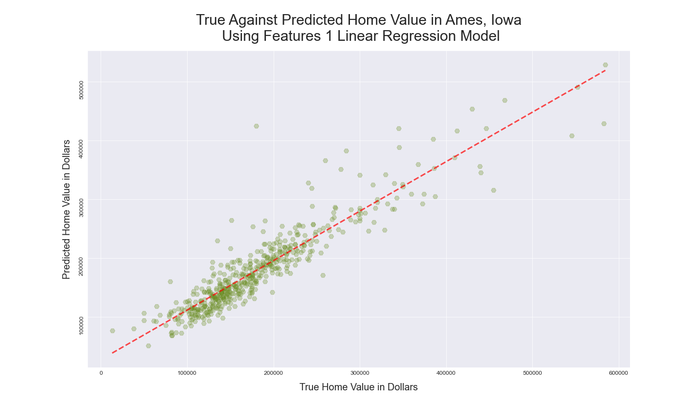
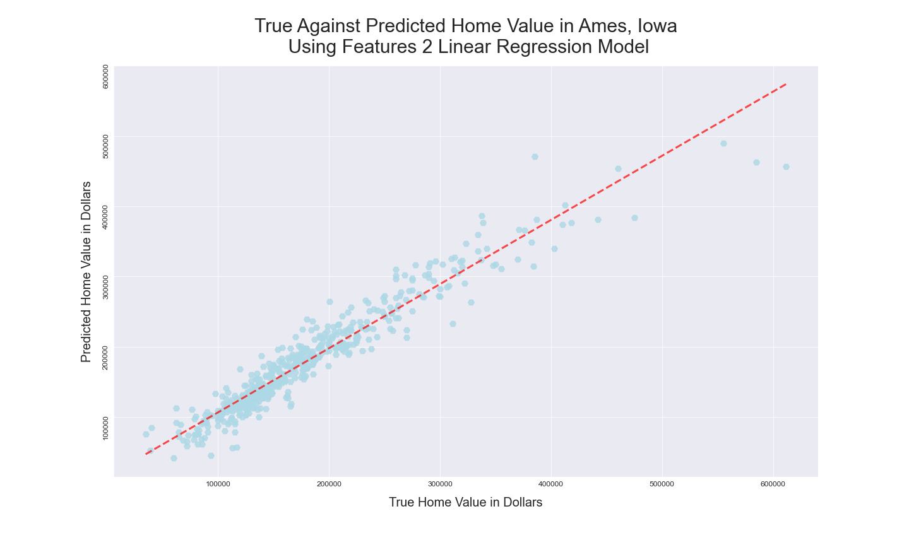
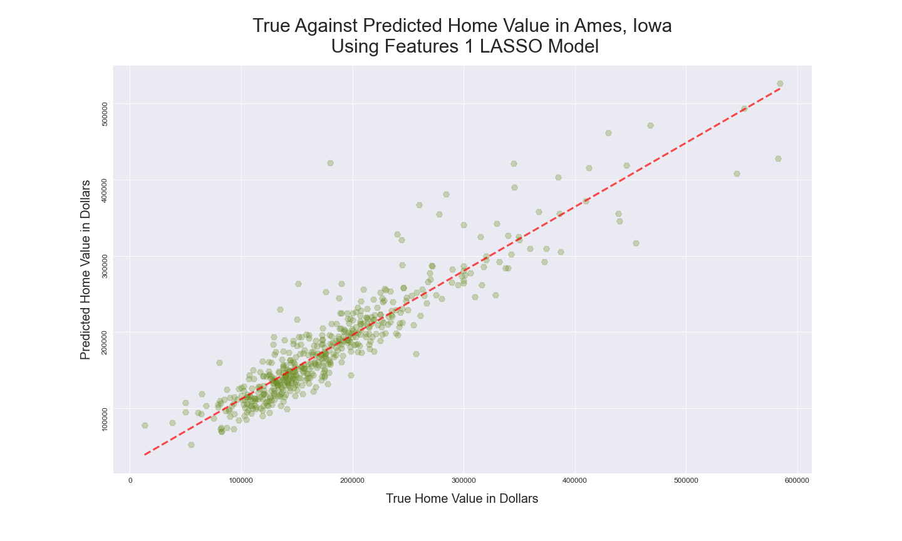
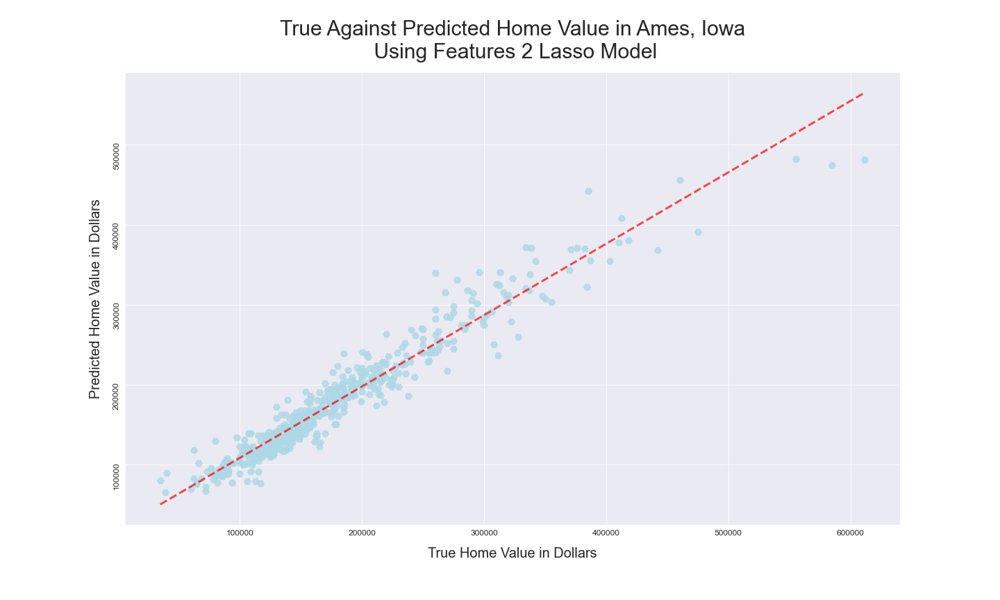
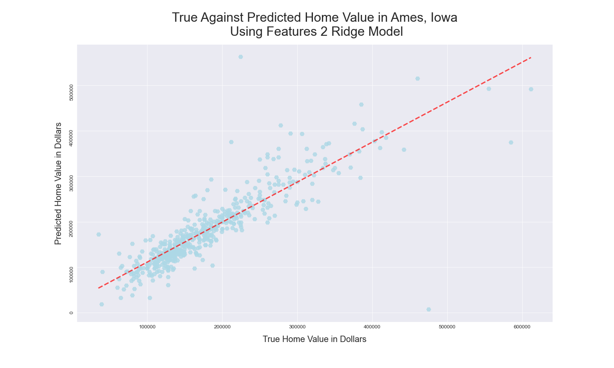

# Predicting Housing Prices in Ames, Iowa

#### Project by Joey Navarro


Photo by [Tom Rumble](https://unsplash.com/@tomrumble?utm_source=unsplash&utm_medium=referral&utm_content=creditCopyText) on [Unsplash](https://unsplash.com/s/photos/houses?utm_source=unsplash&utm_medium=referral&utm_content=creditCopyText)

## Problem Statement

Using the Ames Housing Data from 2006-2010, build a linear regression model that will most accurately predict housing prices (given 80 housing features to select from and model with).

## Executive Summary

This project was was to predict housing prices for Ames, Iowa, given a dataset from the Ames, Iowa Assessor's Office containing information on houses sold between 2006-2010 ([data dictionary and information can be found here](http://jse.amstat.org/v19n3/decock/DataDocumentation.txt).) My challenge was to build a linear regression model that would most accurately predict housing prices (given 80 housing features to select from and model with).

Key decisions I made during the modeling process:

**1. Filled null values with 0:** I didn't drop columns with significant null values. When I examined the columns with nulls, I found most of them weren't really reflecting missing information but were input as 'NA' because a house didn't have that feature (ex. pool). I didn't feel it was necessary to treat categorical and numerical columns differently when filling 'null' cells with 0 because I ultimately dummied out the categorical data anyway.

**2. Dropped Outliers:** The data dictionary as well as subplots of the nominal data columns provided a clue on outliers in the data. Plotting sale price against above grade living area  and lot area narrow down the data in the dataset. According to the data dictionary, it's likely the outliers in our data were from unusual partial sales of large properties. I chose to remove the outliers to make the model better predict the majority of housing prices, and this did improve my model's scores. 

**4. Feature Selection:** I had two feature models for my first model, I only included features that had an affect on the sale price according to an OLS hypothesis test. For my second feature model, I used every numerical feature and created a dummy columns dataframe  for nominal and ordinal features which was then concatinated to the trainning and testing dataframes. There were other features that I modified (ex. changed year built to decade and made this categorical) but in general I didn't drop features from the model. I scaled all the features but only used used polynomial features on the second features lasso model.

**5. Normalizing Features:** Plotting the distribution of sale prices, there was a strong positive skew that was going to impact the skew of my residuals. I dealt with this by taking the natural log of saleprice (and reversing the log with np.exp after making predictions to convert them back into sale prices at the end) for the first feature models. I did not normalize the saleprice distribution for the second features model. I did normalize a positive skew first floor square foot distribution with a natural log to correct a positive skew on both features models.

**6. Linear, Lasso, Ridge Regression :** I decided to use a linear, lasso, and ridge regression for the two feature selections I made in order to explore the best possible R2 results. The following were the cross validated scores for both features:

#### Features 1

```
=================================Linear Regression Trainning Model==================================
R2 accuracy scores: [0.8143551  0.8561741  0.85683833 0.78311332 0.8468853 ]
Mean R2 accuracy percentage score: 83.15%
======================================= LASSO Trainning Model=======================================
R2 accuracy scores: [0.81370306 0.8562642  0.85549358 0.78330549 0.84813553]
Mean R2 accuracy percentage score: 83.14%
====================================== Ridge Trainning Model =======================================
R2 accuracy scores: [0.81334599 0.85632417 0.85690038 0.78303623 0.84709909]
Mean R2 accuracy percentage score: 83.13%
```

#### Features 2

```
=================================Linear Regression Trainning Model==================================
R2 accuracy scores: [0.93107482 0.90936166 0.8927695  0.92091675 0.91120928]
Mean R2 accuracy percentage score: 91.31%
====================================== Ridge Trainning Model =======================================
R2 accuracy scores: [-0.07766958 -0.0731773  -0.02480281 -0.07054359 -0.00858686]
Mean R2 accuracy percentage score: 91.36%
=======================================LASSO Trainning Model =======================================
R2 accuracy scores: [0.93183718 0.9067743  0.89368633 0.93125707 0.3766999 ]
Mean R2 accuracy percentage score: 80.81%
```

## Project Directory

```
Predicting Housing Prices in Ames, Iowa
|--datasets
		|--test.csv
		|--train.csv
|--presentation
		|--Predicting Housing Prices in Ames, Iowa.pdf
		|--Predicting Housing Prices in Ames, Iowa.pptx
|--price_prediction_notebook.ipynb
|--README.md
|--tom-rumble-houses.jpg
|--visualizations
		|--True_vs_Predicted_Home_Value_in_Ames_Iowa_Using_a_Lasso_Model_features_1.png
		|--True_vs_Predicted_Home_Value_in_Ames_Iowa_Using_a_Lasso_Model_features_2.png
		|--True_vs_Predicted_Home_Value_in_Ames_Iowa_Using_a_Linear_Regression_Model_features_1.png
		|--True_vs_Predicted_Home_Value_in_Ames_Iowa_Using_a_Linear_Regression_Model_features_2.png
		|--True_vs_Predicted_Home_Value_in_Ames_Iowa_Using_a_Ridge_Model_features_1.png
		|--True_vs_Predicted_Home_Value_in_Ames_Iowa_Using_a_Ridge_Model_features_2.png
	
```


## Notebook Table of Contents

**A.** [**Importing & EDA**](#lim)

    1.  [Library Imports](#imports)
    2.  [Data Read In](#read-in)
    3.  [Initial Exploratory Data Analysis](#initial-eda)
    4.  [Correlations between Saleprice and House Features](#correl)
    5.  [Name Nominal, Numerical, Ordinal, and the Target Columns](#targ-col)
    6.  [Explore Numerical Columns](#num-col)
    7.  [Explore the Relationship Between the Nominal Values and Sale Price](#nom-sale)
    8.  [Initiate a Hypothesis Test of the Numeric Columns](#hypo)


**B.** [**Feature Engineering & Selection**](#feat-eng)

    8.  [Explore & filter dataframe to remove outliers](#filter)
    9.  [Nomalize distribution of right skewed column](#norm-right)
    10.  [Dummy values for nominal data columns](#dummy)

**C.** [**Modeling & Visualizations & Predictions**](#model-t1)

    11.  [Model Testing, Fitting, and Evaluation for Features_1](#model)
    12.  [Model Cross Validations for Features 1](#cross-val1)
    13.  [Linear Regression Model for Features 1](#lr-feat1)
    14.  [LASSO Model for Features 1](#lasso-feat1)
    15.  [Ridge Model for Features 1](#ridge-feat1)
    16.  [Model Cross Validations for Features 2](#model-t2)
    17.  [Model Testing, Fitting, and Evaluation for Features 2](#model-t2)
    18.  [Linear Regression Model for Features 2](#lr-feat2)
    19.  [Ridge Model for Features 2](#ridge-feat2)
    20.  [LASSO Model for Features 2](#lasso-feat2)

**E.** [**Final Thoughts**](#final)


## Data Dictionary & Sources

For the Ames dataset, I removed outliers recommended by the Data Document Linked below.  I also removed several data points where the given value was unrealistically large given the cost of the home. 


| Final Attribute  | Data Type | Short Description                           |
| ---------------- | --------- | ------------------------------------------- |
| Gr Liv Area      | INT64     | Ground living area in square feet           |
| Year Built       | INT64     | Year home was built                         |
| Overall Cond Bi  | INT64     | 1 if overall cond  >=  5, else 0            |
| Year Remod/Add   | INT64     | Year home remodeled                         |
| Tot_bath_bsmt    | INT64     | Total number of bathrooms in the basement   |
| Lot Area         | INT64     | Lot size                                    |
| Sale Type Bi     | INT64     | 1 if 'New', 2 if 'Oth' or 'CWD', else 0     |
| Outdoor Liv Area | INT64     | Wood Deck SF + Open Porch SF + Screen Porch |
| Bldg Type Bi     | INT64     | 1 if '1fam' or 'TwnhmE', else 0             |
| TotRms AbvGrd    | INT64     | Total number of rooms above ground          |
| Mo Sold          | INT64     | Month sold                                  |
| Yr Sold          | INT64     | Year sold                                   |
| Tot_bath_abv_grd | INT64     | Total number bathrooms above ground         |
| Kitchen AbvGr    | INT64     | Number of kitchens above ground             |
| Bedroom AbvGr    | INT64     | Total number of bedrooms above ground       |


Please see the following websites for 

* [http://jse.amstat.org/v19n3/decock/DataDocumentation.txt] Data Dictionary of Original Data
* [https://www.kaggle.com/c/dsi-us-6-project-2-regression-challenge] Data Source


### Best Model Results 

#### Features 1

```
===========================Linear Regression Model Prediction Statistics============================
R2 for Linear Regression Prediction: 0.8700234972388585
MSE for this Linear Regression model is: 686366622.7770644
RMSE for this Linear Regression model is: 26198.59963389388

=================================LASSO Model Prediction Statistics==================================
Lasso Predicted R2:0.8706816416380891
MSE for this LASSO model is: 682891161.1435899
RMSE for this LASSO model is: 26132.186306231437

=================================Ridge Model Prediction Statistics==================================
R2 for this Ridge Prediction :0.8703364117573583
MSE for this Ridge model is: 684714215.7902782
RMSE for this Ridge model is: 26167.044460356585
```


#### Features 2

```
===========================Linear Regression Model Prediction Statistics============================
R2 for Linear Regression Prediction: 0.9206366157181036
MSE for this Linear Regression model is: 499113738.4875931
RMSE for this Linear Regression model is: 22340.85357562672

=================================LASSO Model Prediction Statistics==================================
R2 for this LASSO Prediction: 0.9308087194010227
MSE for this LASSO model is: 435141709.78186566
RMSE for this LASSO model is: 20860.050569973835

=================================Ridge Model Prediction Statistics==================================
R2 for this Ridge Prediction :0.9206067964317198
MSE for this Ridge model is: 499301271.0082985
RMSE for this Ridge model is: 22345.050257457435


```


### Best Model Result Visualizations

|  |  |
| ------------------------------------------------------------ | ------------------------------------------------------------ |
|  |  |
|  |  |


### Conclusions & Next Steps

Using a lasso regression along with a few data transformations, removal of extreme outliers, and the creation of dummy variables allowed me to fit a model that performed with an R2 value of  0.93.  The next steps are to attempt to predict the exact prices, I may want to try more advanced models or use classifying methods for variable selection.  

